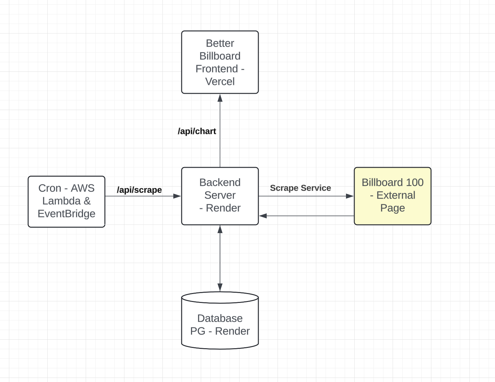

# Overview
An art project of the weekly billboard chart

# Implementation Details 
* Backend is written in Python and is a Flask App Deployed on Render
* Cron a Python written AWS Lambda with an AWS EventBridge cron event every Tuesday (32 5 ? * 3 * ). The CRON hits the backend and tell it to perform the scrape amd save it to the database. 
* Frontend is NextJS and deployed on Vercel

# Getting Started Guide
## Backend 
1. Ensure you have python installed using `$ python --version`. The project supports Python 3.12.4
2. Clone the Project `$ git clone https://github.com/Kyle01/Better-Billboard.git` 
3. Change directory to the backend `$ cd api`
4. Create a new virtual environment using `$ python -m .venv` 
5. Change directory to the bin of the virtual environment `$ cd .venv/bin/`
6. Start the virtual environment `$ source activate` 
7. Change directory back to the api folder with `$ cd ../.. ` 
8. Install the requirements `pip in`stall -r requirements.txt`
9. Start the flask server with `flask --debug run`
10. Server will be running on http://127.0.0.1:5000

## Frontend
1. Ensure node installed with `$ node --version`. The project supports node 20.10.0
2. Install the frontend with `$ npm i`
3. Start up the server with `$ pnpm dev`
4. Frontend server will be up and running on http://localhost:3000/